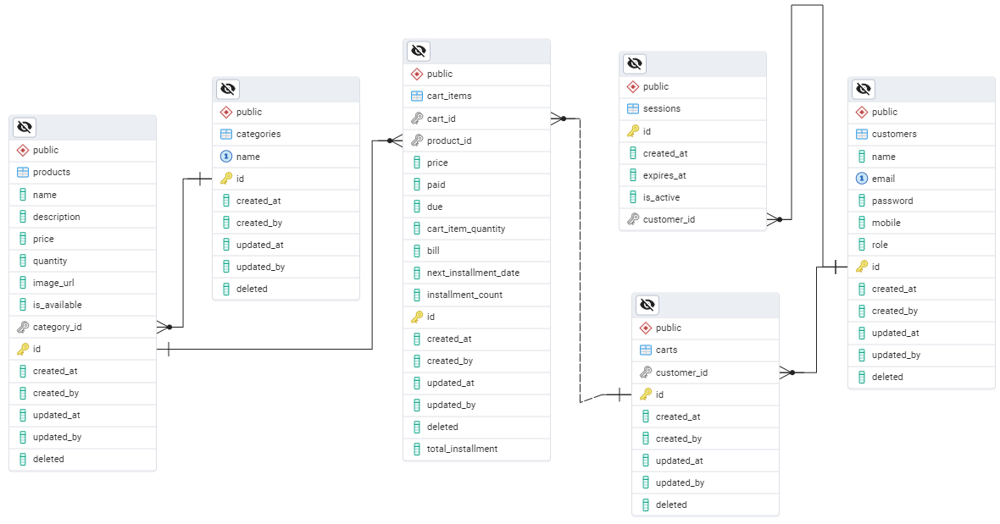

# Installment-Policy
A FastAPI project where customers can purchase products with installment policy.

## API Documentation
View the [Postmand API Documentation](https://documenter.getpostman.com/view/39540382/2sB2cd5JNK)
Download `Instalment Policy.postman_collection.json` from the repository to get the full API collection.

## Admin credentials for test purpose 
- **Email**: admin@shop.com
- **Password**: AdminSh@p

## ER Diagram
 </br>

## Features

- OTP and Gmail-based registration
- Basic authentication with role-based authorization
- The customer can purchase a product with an installment plan
- An email notification will be sent as a reminder before n days of the installment date
- Admin can download a weekly or monthly report of the customer who has due as a CSV file or a JSON response
- Admin can view a weekly or monthly Due vs. Paid Amount chart of customers

## Tech Stack

- **Backend**: Python, FastAPI, SQLAlchemy
- **Frontend**: HTML, CSS, JavaScript
- **Database**: PostgreSQL

### Installation

1. Clone the repository:
   ```bash
   https://github.com/MdTanvirHossainTusher/Installment-Policy.git
   ```

2. Create and activate a virtual environment:
   ```bash
   python -m venv venv
   source venv/bin/activate  # On Windows, use: venv\Scripts\activate
   ```

3. Install dependencies:
   ```bash
   pip install -r requirements.txt
   ```

4. Copy `.env.example` file to `.env` file and fillup the blanked values

### Running the Application

1. Start the development server:
   ```bash
   python run.py
   ```

2. Open your browser and navigate to `http://localhost:8000`

### Using Docker

1. Build and run the Docker container:
   ```bash
   docker-compose up --build
   ```

2. Open your browser and navigate to `http://localhost:8000`


## Application Overview

 </br>
 </br>
 </br>
 </br>
 </br>
 </br>
 </br>